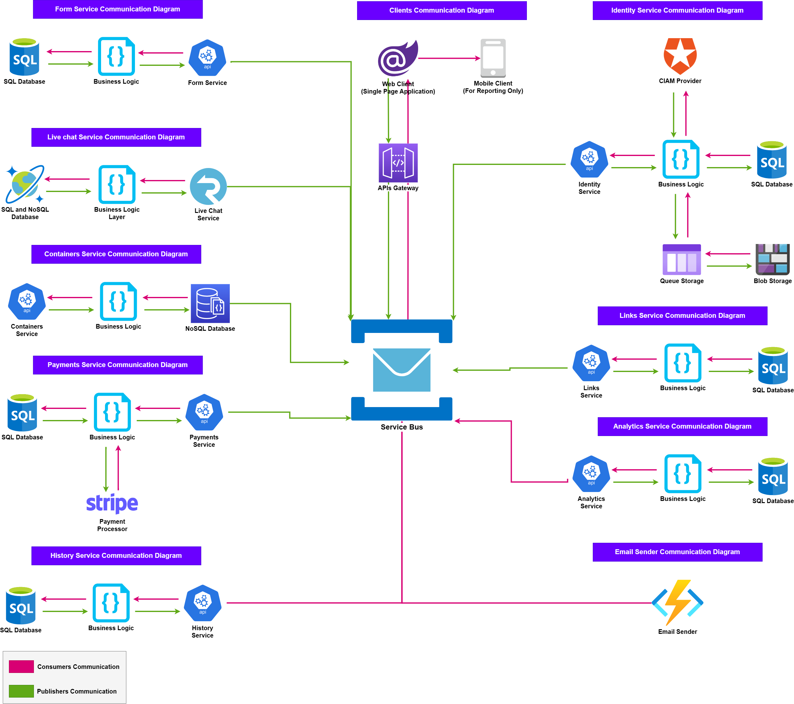

# Formee.io (SaaS Project)

## Build and Tests Status

**To be added soon!**

## What is Formee?

**Formee** is a web-based SaaS that helps people boost productivty and focus on building the client-side (Front-end) of the website. Where the target _Customers (Users)_ are front-end developers and people who are inexperinced in buiding the server-side (backend).

### Software Architecture

Microservices architecture is the architectural style of the software, where it depends on small services that communicates together to form the full picture of the system. See [Software Architecture](docs/ARCHITECTURE.md) to learn more about the inner architecture implementation. In a nutshell, the services are:

1. Form Service
2. Live Chat Service
3. Containers Service
4. Payments Service
5. History Service
6. Identity Service (Powered by a third part CIAM)
7. Links Services
8. Analytics Service
9. Email Service (Servless Component)

### Software Tech Stack

#### Server-side Services Technologies

| No  | Service     | Technologies                                                                            | Design Patterns                                              |
| --- | ----------- | --------------------------------------------------------------------------------------- | ------------------------------------------------------------ |
| 1   | Form        | <ol><li>ASP.NET 7 (C# 11)</li> <li>SQL Server</li> <li>Docker</li></ol>                 | <ol><li>Clean Architecture<li>MediatR and CQRS</li></ol>     |
| 2   | Live Chat   | <ol><li>ASP.NET 7 (C# 11)</li> <li>SignalR</li> <li>CosmosDB</li> <li>Docker</li></ol>  | <ol><li>Clean Architecture<li>Publisher/Subscriber</li></ol> |
| 3   | Containers  | <ol><li>ASP.NET 7 (C# 11)</li> <li>SignalR</li> <li>MongoDb</li> <li>Docker</li></ol>   | <ol><li>Publisher/Subscriber</li> </ol>                      |
| 4   | Payments    | <ol><li>ASP.NET 7 (C# 11)</li> <li>SQL Server</li> <li>Docker</li> <li>Stripe</li></ol> | <ol><li>Publisher/Subscriber</li> </ol>                      |
| 5   | History     | <ol><li>ASP.NET 7 (C# 11)</li> <li>SQL Server</li> <li>Docker</li></ol>                 | <ol><li>Publisher/Subscriber</li> </ol>                      |
| 6   | Identity    | <ol><li>ASP.NET 7 (C# 11)</li> <li>SQL Server</li> <li>Docker</li><li>Auth0</li></ol>   | <ol><li>Publisher/Subscriber</li> </ol>                      |
| 7   | Links       | <ol><li>ASP.NET 7 (C# 11)</li> <li>SQL Server</li> <li>Docker</li></ol>                 | <ol><li>Publisher/Subscriber</li> </ol>                      |
| 8   | Analytics   | <ol><li>ASP.NET 7 (C# 11)</li> <li>SQL Server</li> <li>Docker</li></ol>                 | <ol><li>Publisher/Subscriber</li> </ol>                      |
| 9   | Emails      | <ol><li>ASP.NET 7 (C# 11)</li> <li>SQL Server</li> <li>Azure Functions</li></ol>        | <ol><li>Publisher/Subscriber</li> </ol>                      |
| 10  | API Gateway | <ol><li>ASP.NET 7 (C# 11)</li> <li>Ocelot Library</li></ol>                             | None                                                         |

All publisher/subscriber design patterns are implemented with Azure Service Bus

#### Client-side Technologies

| No  | Client     | Technologies                                                                      | Design Pattern |
| --- | ---------- | --------------------------------------------------------------------------------- | -------------- |
| 1   | Website    | <ol><li>ASP.NET 7 (C# 11) Blazor</li> <li>Syncfusion</li></ol>                    | MVVM           |
| 2   | Mobile App | <ol><li>.NET MAUI</li> <li>ASP.NET 7 (C# 11) Blazor</li> <li>Syncfusion</li></ol> | MVVM           |

### Codebase Guidelines

Please the following link [Code Styles](docs/CODE.md) to find the code guidelines and in-depth architecture explanation.

Developed and Designed by **_Sayed Mohammed Alwedaei_**

A huge thanks to **Dr. _Jenan_**
